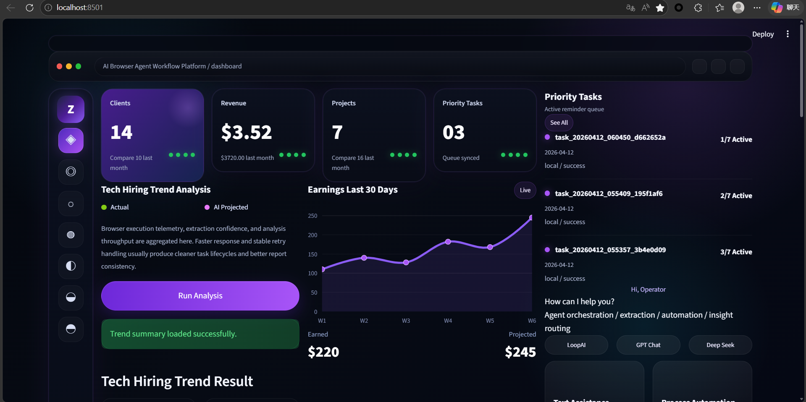
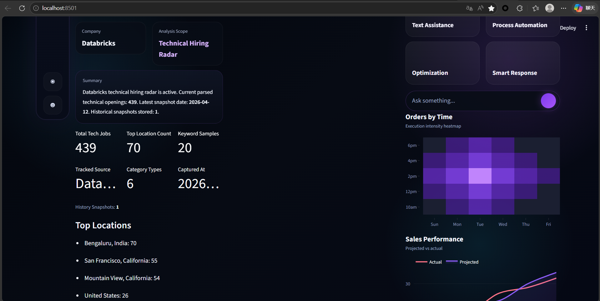
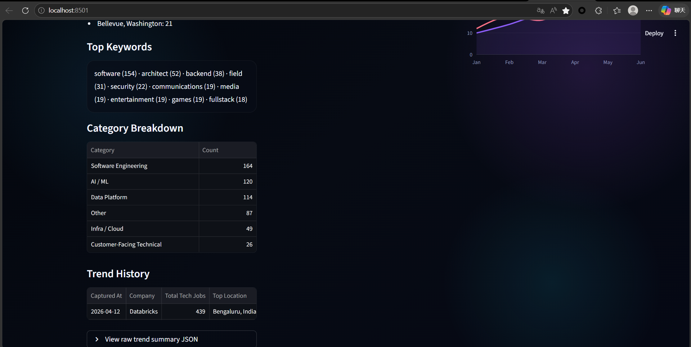
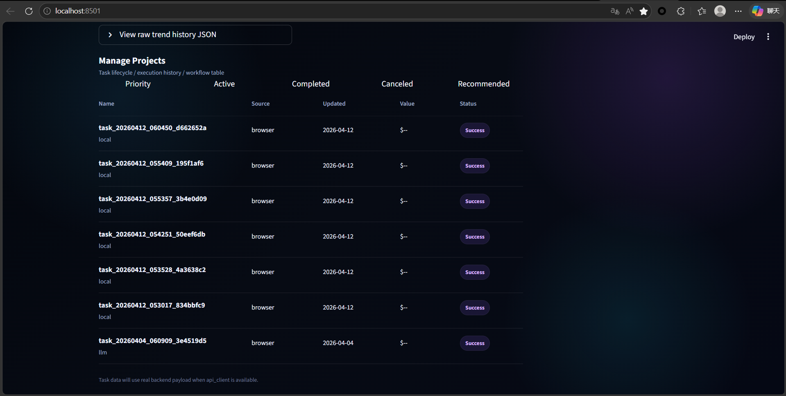
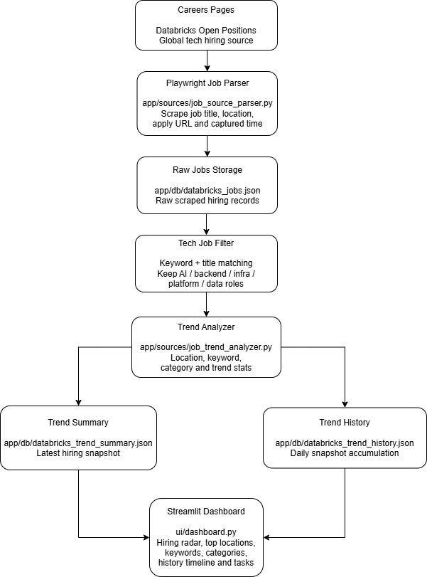
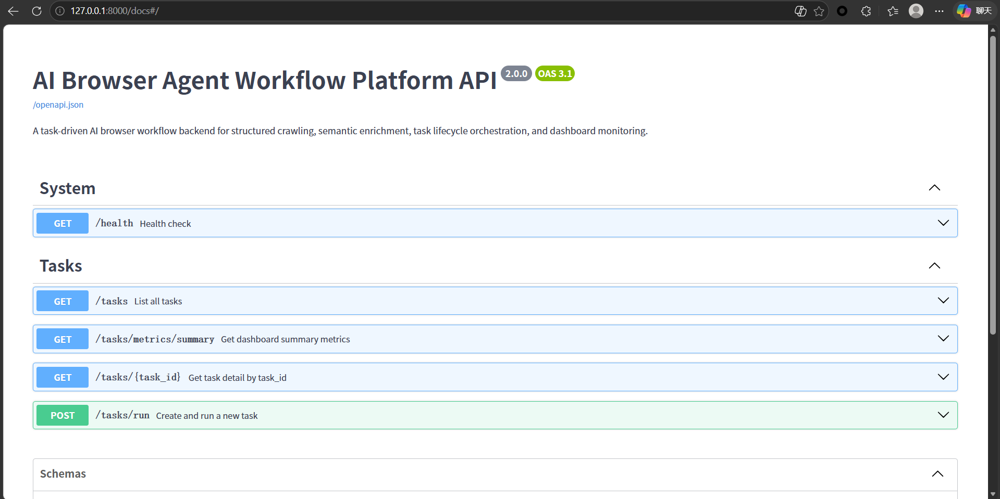
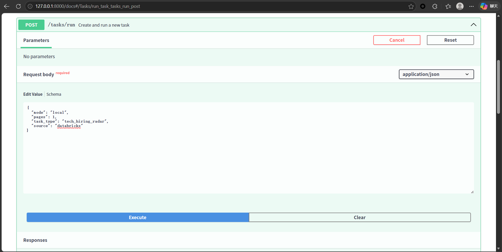
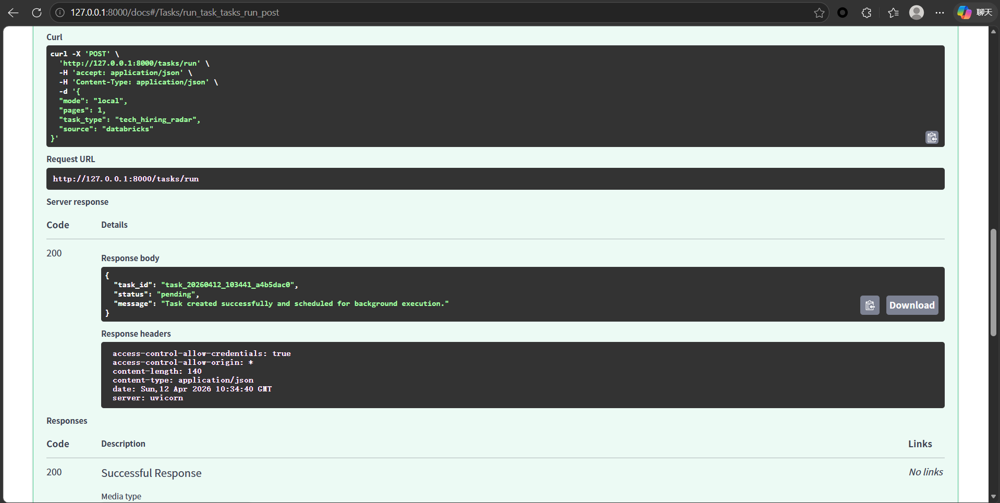

# 🚀 AI Browser Agent Workflow Platform

A portfolio-grade **AI-powered browser workflow platform** built with **FastAPI, Playwright, and Streamlit**.

This project upgrades browser automation from a one-off crawler script into a **platformized workflow system** with:

- task lifecycle orchestration
- structured browser data extraction
- historical task persistence
- trend analytics
- visual dashboard delivery
- production-style API services

It is designed as a **resume-ready AI engineering showcase project** for AI application, workflow, and platform engineering roles.

---

## ✨ Core Highlights

- 🤖 Playwright-powered browser automation
- 🔄 Task lifecycle orchestration
- 📦 Historical task snapshot persistence
- 📈 Trend analysis and keyword mining
- 📊 Streamlit workflow dashboard
- 🔌 FastAPI backend service APIs
- 🧠 Workflow-oriented system architecture
- 📚 Swagger execution proof for technical interviews

---

## 🖥️ Dashboard Overview

A polished visual dashboard for browser workflow monitoring and trend intelligence.



---

## 📈 Trend Analytics Panel

The analytics panel highlights:

- total tasks
- latest trend metrics
- top locations
- recurring keywords
- role category distribution



---

## 🕒 Category & History Panel

Supports:

- category breakdown
- trend history
- keyword accumulation
- snapshot timeline



---

## 📋 Task Lifecycle Table

All tasks are persisted and visualized through a lifecycle table.

Tracked fields include:

- task_id
- source
- status
- updated_at
- lifecycle history



---

## 🧠 System Architecture

Pipeline:

Browser Source → Parser → Task Store → Analyzer → Summary → History → Dashboard



### Modules
- Browser Source
- Playwright Parser
- Task Storage
- Workflow Manager
- Trend Analyzer
- Snapshot Summary
- History Accumulator
- Streamlit Dashboard

---

## 🔌 API Workflow

### Swagger Overview


### Run Task Request


### Run Task Response


---

## ⚙️ Tech Stack

### Backend
- FastAPI
- Uvicorn
- Playwright
- Python 3.11

### Frontend
- Streamlit
- Metrics panels
- Task lifecycle table
- Trend analytics blocks

### Workflow
- task orchestration
- async scheduling
- historical snapshots
- structured trend analytics

---

## 🚀 Quick Start

### 1. Backend
```bash
uvicorn app.api.main:app --reload
```

### 2. Dashboard
```bash
streamlit run ui/dashboard.py
```

### 3. Swagger
```bash
http://127.0.0.1:8000/docs
```

---

## 📌 Roadmap

- PostgreSQL persistence
- Docker Compose deployment
- multi-source browser workflows
- task retry queue
- daily scheduled automation
- AI-generated workflow reports
- cloud deployment pipeline

---

## ⭐ Technical Blog

Juejin Write-up:  
https://juejin.cn/post/7627400127372935214
