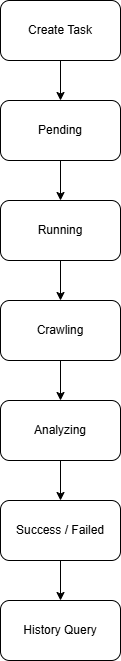

# 🤖 AI Browser Agent Workflow Platform

An AI-powered, task-driven browser automation workflow platform for structured crawling, semantic enrichment, task lifecycle orchestration, and real-time dashboard observability.

---

## 🌟 Overview

This project upgrades a traditional Playwright crawler script into a **production-style task-driven AI workflow platform prototype**.

It provides:

* Automated multi-page browser crawling
* Task lifecycle orchestration
* Local / optional LLM semantic enrichment
* Streamlit real-time dashboard
* Historical task querying
* RESTful APIs powered by FastAPI
* Persistent JSON-based task storage
* Fault-tolerant, retry-ready workflow design

> Workflow Pipeline:
> **Playwright → Task Manager → FastAPI → Streamlit Dashboard → Persistent Task Storage**

---

## 📸 System Preview

### 🖥️ Dashboard Overview


### 📂 Task Detail View


### 🔌 API Overview


### 🚀 Run Task via Swagger


---

## 🧠 System Architecture


---

## 🔄 Task Lifecycle



---

## 🔥 Core Features

### 🌐 Browser Automation (Playwright)

* Automated multi-page crawling
* Configurable crawl depth via `pages`
* Structured extraction of:

  * quote text
  * author
  * tags
  * page metadata

---

### ⚡ Task Lifecycle Management

Each task follows a complete lifecycle:

```text
Create Task → Pending → Running → Crawling → Analyzing → Success / Failed → Task History
```

Core capabilities:

* Unique `task_id`
* Persistent task-scoped storage
* Historical task traceability
* Status-based dashboard filtering
* FastAPI background execution
* Retry-ready workflow orchestration

---

### 🧠 Semantic Enrichment Pipeline

Each crawled quote can be enriched with:

* `ai_theme`
* `ai_sentiment`
* `ai_tone`
* `ai_summary`

Task-level aggregated analysis includes:

* total quote count
* unique authors
* total tags
* author statistics
* task summary report

---

### 📊 Real-Time Dashboard (Streamlit)

#### 📋 Task Control

* Configure pages
* Select execution mode
* Create tasks
* Instant status feedback

#### 📂 Task History

* Task list
* Lifecycle status
* Expandable task detail
* Result JSON preview
* Timestamps
* Report visibility

---

### 🔌 FastAPI APIs

RESTful endpoints:

* `/tasks/run`
* `/tasks`
* `/tasks/{task_id}`

Additional features:

* Swagger UI
* Interactive testing
* Background task execution
* Task-level querying

---

## 📊 Example Output

```json
{
  "text": "The world as we have created it is a process of our thinking.",
  "author": "Albert Einstein",
  "tags": ["change", "thinking"],
  "ai_theme": "deep-thoughts, change",
  "ai_sentiment": "neutral",
  "ai_tone": "philosophical",
  "ai_summary": "A reflective quote about how human thinking shapes reality."
}
```

---

## 🛠️ Tech Stack

* Python
* Playwright
* FastAPI
* Streamlit
* JSON persistent storage
* Local LLM / optional API LLM
* requests

---

## 📂 Project Structure

```text
AI-Browser-Agent/
├── app/
│   ├── crawler/
│   ├── analyzer/
│   ├── api/
│   └── task/
├── ui/
│   └── dashboard.py
├── data/
│   └── tasks/
├── assets/
│   ├── dashboard-overview.png
│   ├── dashboard-task-detail.png
│   ├── swagger-api-overview.png
│   ├── swagger-run-task.png
│   ├── system_architecture.png
│   └── task_lifecycle.png
├── requirements.txt
└── README.md
```

---

## ▶️ Getting Started

```bash
python -m venv venv
venv\Scripts\activate
pip install -r requirements.txt
playwright install
```

---

## 🚀 Run the Project

### Start FastAPI

```bash
uvicorn app.api.server:app --reload
```

### Start Dashboard

```bash
streamlit run ui/dashboard.py
```

---

## 📡 API Endpoints

| Endpoint           | Description          |
| ------------------ | -------------------- |
| `/tasks/run`       | Create task          |
| `/tasks`           | List task history    |
| `/tasks/{task_id}` | Retrieve task detail |

---

## 🚧 Future Improvements

* PostgreSQL persistence
* Celery / Redis distributed queue
* Docker deployment
* Multi-site crawling adapters
* Vector search + RAG layer
* Task export APIs
* Observability metrics

---

## 👩‍💻 Author

Catherine ✨

> Not just a crawler — but a **mini task-driven AI workflow platform prototype**.
